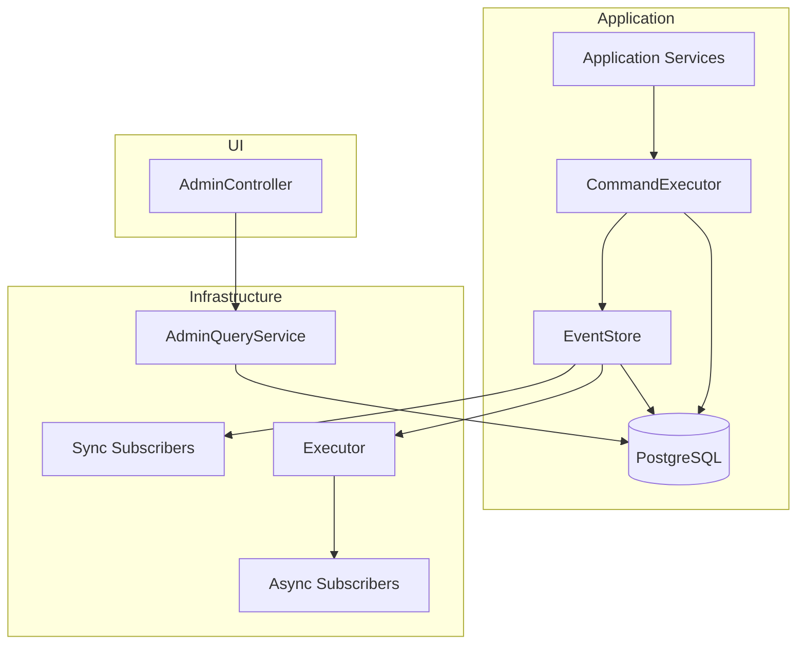

# Requirements & Design

### Overview & Goals
The goal is to improve the design of `PostgresPersister` and `EventStore` to support multi-instance resiliency, improve separation of concerns, and enforce architectural boundaries. Currently, sequence generation is instance-local, and `PostgresPersister` mixes core persistence logic with complex Admin UI queries.

### Scope
- **In Scope:**
    - Migration of sequence generation to PostgreSQL.
    - Support for asynchronous event subscribers in `EventStore`.
    - Splitting `PostgresPersister` into focused Write (Persistence) and Read (Admin Query) components.
    - Enforcement of the "CommandExecutor bridge" architectural rule.
- **Out of Scope:**
    - Full removal of the in-memory log in `EventStore` (retained for speed as per user preference).
    - Changes to the underlying JSON serialization format.

### Functional Requirements
- **Strict Event Ordering:** Event sequences must be unique and monotonic across multiple application nodes.
- **Eventual Consistency Support:** Projectors that do not require strong consistency should be able to process events asynchronously to avoid blocking command execution.
- **Admin UI Isolation:** Admin-specific queries should not clutter the core event storage infrastructure.

### Technical Design

#### 1. Durable Sequence Generation
We will move the responsibility of generating sequence numbers to the database using a PostgreSQL `SEQUENCE`.
- **Database:** Add `event_sequence` to `schema.sql` and synchronize it with the current `MAX(sequence)`.
- **Persistence:** `PostgresPersister` will use `RETURNING sequence` to inform `EventStore` of the assigned numbers.

#### 2. EventStore Subscriber Model
`EventStore` will be updated to manage two distinct lists of subscribers.
- **Synchronous:** Notified in the same thread as the command, maintaining strong consistency.
- **Asynchronous:** Notified via an injected `Executor`, enabling eventual consistency without performance impact on the writer.
- **Invariant:** Persistence to the database will ALWAYS occur before ANY subscriber notification.

#### 3. Separation of Concerns
`PostgresPersister` will be refactored to follow the Single Responsibility Principle.
- **`PostgresEventRepository`**: Focused on the "Write Side" and replaying the full log.
- **`TimelineQueryService`**: Focused on the "Read Side" for the Admin UI, handling pagination, stats, and pretty-printing JSON.

#### 4. Architecture Diagram

#### 5. Architecture Enforcement
We will add an ArchUnit test to ensure that the `application` package remains decoupled from the low-level `EventStore`. All application services must use `CommandExecutor` to ensure proper write-ahead logging and foreign key constraint adherence.

### Testing
- **Unit Tests:** Update `EventStoreTest` to verify sequence handling from the mock persister and async notification behavior.
- **Architecture Test:** Implement `EventStoreInjectionTest` to catch dependencies on `EventStore` in the `application` package.
- **Integration Tests:** Verify the Postgres sequence works correctly during full system execution.

# Delivery Steps

###   Step 1: Move sequence generation to PostgreSQL
Ensure event sequence numbers are unique and strictly increasing across multiple application instances.
- Add `CREATE SEQUENCE event_sequence` to `src/main/resources/schema.sql`.
- Update `PostgresPersister.appendEvents` to use `nextval('event_sequence')` for the `sequence` column in the `INSERT` statement.
- Modify `PostgresPersister.appendEvents` to return the list of `StoredEvent` objects (containing the DB-generated sequences).
- Remove `AtomicLong nextSequence` from `EventStore.java` and update `append()` to use the returned events from the persister.

###   Step 2: Enhance EventStore with asynchronous subscriptions
Provide flexibility for subscribers to process events synchronously or asynchronously.
- Update `EventStore` constructor to accept a `java.util.concurrent.Executor`.
- Add `subscribeAsync(EventStreamConsumer consumer)` to `EventStore`.
- Update `EventStore.append()` to notify synchronous subscribers immediately, then dispatch notifications to asynchronous subscribers using the executor.
- Update `EventSourcingConfig.java` to inject the `Executor` bean into `EventStore`.

###   Step 3: Refactor PostgresPersister and extract Admin queries
Improve maintainability by separating core persistence from UI/Admin query logic.
- Extract UI-focused methods from `PostgresPersister.java` (e.g., `loadTimelinePage`, `findPendingCommands`, `countEvents`, `tableStats`) into a new `AdminQueryService.java` or `PostgresAdminRepository.java`.
- Keep `PostgresPersister` focused on core event/command storage and loading for replaying the log.
- Move UI-related DTOs (`TimelineEntry`, etc.) if they are not already in a shared location.
- Update `AdminController` to use the new query service.

###   Step 4: Refactor Application Services and enforce Architecture Rules
Align the codebase with the "CommandExecutor bridge" rule and prevent future violations.
- Refactor `ConferencePlanning` and `CommandImporter` to use `CommandExecutor` instead of injecting `EventStore` directly.
- Add an ArchUnit test `EventStoreInjectionTest` in `src/test/java/dev/ted/jittertravel/architecture/` that asserts no class in the `application` package (except `CommandExecutor`) has a field of type `EventStore`.