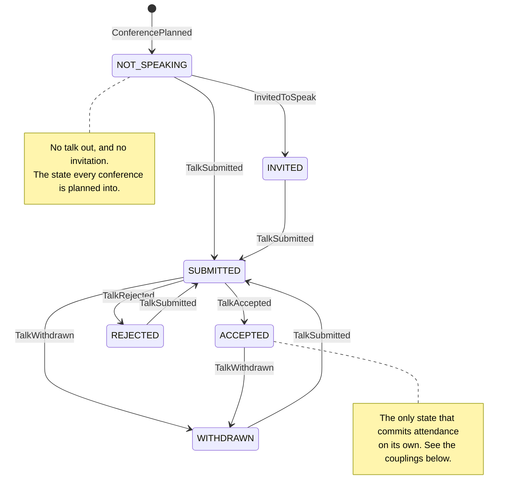
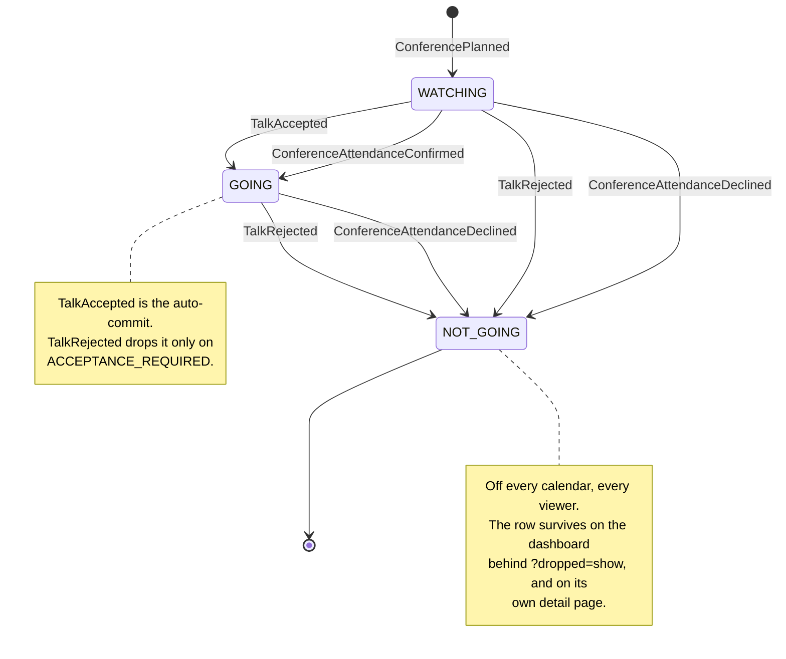

# The conference state machine

Where one conference stands, what moves it, and what the app offers to do about it. Written down
2026-09-06, after a review found that `ConferenceActions` had quietly modelled the two axes below as
one — see "The bug this doc exists because of" at the end.

The rules themselves live in `ConferenceProgress` (application), the domain's refusals live on the
`*Command` records, and what a surface offers lives in `ConferenceActions` (web). This doc is the
map; where it and the code disagree, the code is right and this file is stale — say so rather than
fixing one silently.

## Two axes, and they move independently

A conference has an **attendance** state (`AttendanceCommitment`: is Ted going?) and a **talk** state
(`SpeakingStatus`: where is his talk?). They are not one lifecycle. `ConferenceProgress.submitted()`
and `invited()` both carry the commitment through untouched, and `withdrawn()` does too — so a
conference Ted has a ticket for is *not* finished moving, and `GOING` is not a terminal state.

The realistic pairs are ordinary, not edge cases:

- an early-bird ticket bought in January, a talk submitted to the same conference in March;
- an invitation to keynote something he was already attending.

### The talk axis

**What this diagram deliberately leaves out** (CLAUDE.md: a zoomed-out view is lossy on purpose, and
the losses get named). The domain is wider than the path above, because the catch-up page exists to
enter a conference's history after the fact and the news often arrives out of order:

- `InvitedToSpeak` is legal from **every** talk state — organizers ask whenever they like — so it
  would add five more arrows that all say the same thing.
- `TalkAccepted` and `TalkRejected` are legal from `REJECTED`, `WITHDRAWN` and `ACCEPTED` as well as
  `SUBMITTED` (`AcceptTalkCommand` and `RejectTalkCommand` refuse only `NOT_SPEAKING` and `INVITED`
  — "there is no talk to decide about"). They are corrections, not the ordinary path.

Drawing all of those turns the diagram into a hairball in which the ordinary path — submit, hear
back — stops being visible, and the ordinary path is what the diagram is for. The refusals are the
authority; they are listed under "What the domain refuses" below.

### The attendance axis

A second `ConferenceAttendanceConfirmed` on a conference already `GOING` is legal and is how the
basis is corrected — it moves no state, so it is not drawn.

`ConferenceCancelled` — the organizers pulled the event — is not on either diagram: it removes the
conference from `ConferenceProjector` entirely, so there is no state left to be in.

## The three couplings

The only places the two axes touch. All three are **folds** in `ConferenceProgress`, not extra
events, so they replay and they reverse if the event that produced them is superseded.

| Coupling | Rule | Why |
| --- | --- | --- |
| **Auto-commit** | `TalkAccepted` ⇒ `GOING`, whatever the commitment was | Submitting was already the opt-in; the acceptance completes a decision rather than posing a new one. No confirmation event is written, which is why a conference can be `GOING` with a `null` basis. |
| **Auto-drop** | `TalkRejected` ⇒ `NOT_GOING`, but **only** on `ACCEPTANCE_REQUIRED` | Where acceptance was the way in there is no going anyway. On every other format the same event leaves the conference exactly as committed as it was, with a decision to make. |
| **An invitation commits nothing** | `InvitedToSpeak` leaves the commitment alone | An invitation is an offer. This is the whole difference from an acceptance, and it is what keeps an unanswered invitation off the public calendar. |

**Speaking is derived, never stored** (`ConferenceProgress.speaking()`): the stream wins wherever it
has spoken (`ACCEPTED` ⇒ yes; `SUBMITTED`/`REJECTED`/`WITHDRAWN` ⇒ no), and only `INVITED` and
`NOT_SPEAKING` fall back to whether the last confirmation named a speaking basis. That is what makes
the "A Ted Talk" badge publishable — see CLAUDE.md's redaction section, which is the authority.

## What the app offers, per state

`ConferenceActions.links(...)` — one table, two surfaces (the `/conferences` row and the detail
page's action band). **Talk-side moves are chosen by the talk state alone**; the commitment only
decides whether the attendance-side ones are still worth offering.

| Commitment | Talk state | Moves offered |
| --- | --- | --- |
| `WATCHING` | `NOT_SPEAKING` / `WITHDRAWN` | Submitted · Ticket Bought · Decline |
| `WATCHING` | `NOT_SPEAKING` / `WITHDRAWN`, open space | Ticket Bought · Decline |
| `WATCHING` | `SUBMITTED` | Accepted · Rejected · Withdrawn |
| `WATCHING` | `REJECTED` | Ticket Bought · Decline |
| `WATCHING` | `INVITED` | Invitation Accepted · Decline |
| `GOING` | `NOT_SPEAKING` / `WITHDRAWN` | Submitted · Decline |
| `GOING` | `NOT_SPEAKING` / `WITHDRAWN`, open space | Decline |
| `GOING` | `SUBMITTED` | Accepted · Rejected · Withdrawn |
| `GOING` | `REJECTED` | Decline |
| `GOING` | `INVITED` | Invitation Accepted · Decline |
| `GOING` | `ACCEPTED` | Withdrawn · Decline |
| `NOT_GOING` | any | *(none)* |

Four rules hold this table together:

1. **An inapplicable move is absent, not greyed.** The deliberate exception to CLAUDE.md's
   "unavailable actions are shown disabled": `Accepted` on a conference nothing was submitted to
   names an event that could never be true, and greying it promises a capability that does not
   exist. (Taken with Ted, 2026-08-22.)
2. **No state offers more than three**, which keeps these links rather than a menu and lets the
   dashboard's Actions column be a fixed 240px.
3. **The one place that budget costs a move is `SUBMITTED`, which drops Decline.** While a talk is
   out with the organizers, not going means pulling it first — and every one of the three moves
   leads to a state where Decline is back. Note this was already true of `WATCHING`/`SUBMITTED`
   before the fix; the `GOING` row follows the rule that was already there rather than inventing one.
4. **A dropped conference offers nothing at all**, and that is the only empty row. The domain
   refuses every command against a declined conference — `conferenceExists` is false for it — so a
   move there would lead to a page that says no. Going after all means planning it again.

## What the domain refuses

The state machine above may narrow this, never widen it. A stale page in another tab can post a move
that was legal when it rendered, so these are the real gate:

| Command | Refuses when |
| --- | --- |
| `SubmitTalkCommand` | the conference is `OPEN_SPACE`, or a talk is already `ACCEPTED` |
| `AcceptTalkCommand` / `RejectTalkCommand` | the talk state is `NOT_SPEAKING` or `INVITED` — nothing to decide about |
| `WithdrawTalkCommand` | the talk state is not `SUBMITTED` or `ACCEPTED` — nothing outstanding to pull |
| `InviteToSpeakCommand` | never, beyond the conference existing |
| `ConfirmConferenceAttendanceCommand` | never, beyond the conference existing |
| `DeclineConferenceCommand` | never, beyond the conference existing |
| `OpenCfpCommand` | the conference is `OPEN_SPACE` |

Every one of them also refuses when the conference does not exist — never planned, cancelled by the
organizers, **or declined by Ted**. That last clause is why a dropped conference's detail page
withholds its CFP links and its action band.

## The bug this doc exists because of

Shipped and caught by review the same day, 2026-09-06. `ConferenceActions` returned early on
`GOING` — `Decline`, plus `Withdrawn` when a talk was already accepted — on the reasoning that a
committed conference has nothing left to decide. That reads the two axes as one.

What it cost, on states that are ordinary rather than exotic:

- `GOING` + `SUBMITTED` (ticket bought, then submitted): no surface could record the acceptance, the
  rejection or a withdrawal. The detail page said *"Waiting to hear. The organizers hold this one"*
  beside a band whose only move was to abandon the whole conference.
- `GOING` + `INVITED` (invited to keynote something he was attending): the invitation could not be
  taken up, and since `speaking()` needs the confirmation's basis for `INVITED`, the badge for a talk
  Ted actually gave could never be earned.
- `GOING` + `NOT_SPEAKING` and `GOING` + `WITHDRAWN`: the CFP panel offered the submission page, and
  then there was nowhere to record that he had submitted.

Both states were reachable through ordinary use — `RecordTalkController`'s catch-up page offers
`SUBMITTED` and `INVITED` without consulting the commitment at all — and neither was reachable
*back out of*.

**The guard that now exists** is `ConferenceActionsTest.aTalkTheOrganizersHoldCanBeResolvedWhateverTheCommitment`,
stated over the cross-product of all three enums rather than as another row in the hand-written
table: the table is what a change forgets to extend. `onlyADroppedConferenceOffersNoMoveAtAll` is the
weaker invariant beside it — no live conference is a dead end.
