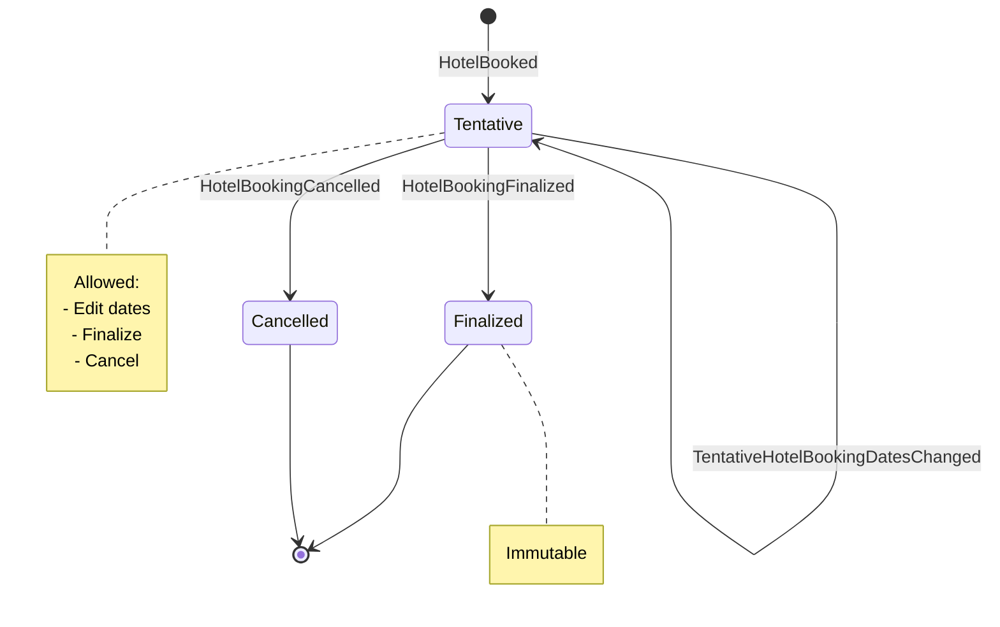

# Lodging — Event Modeling Specification

## Overview

- **Context:** JitterTravel
- **Chapter:** Lodging
- **Mode:** Event Modeling

### Lanes

| Lane             | Type             | Purpose                                                        |
|------------------|------------------|----------------------------------------------------------------|
| Traveler         | User Role        | The logged-in user recording and managing hotel stays          |
| Information Flow | Information Flow | Commands entering the system; data leaving the system          |
| Lodging          | System Context   | Bounded context handling all hotel booking commands and events |

---

## Value Objects

Address is a value object with fields:
- street
- city
- state (this is optional for non-North American addresses)
- postalCode
- country

## Overlap Checking

When recomputing overlap, only recompute those that would be affected by the change. For example, if a traveler changes the check-in date, remove overlap for all bookings that were overlapping with the previous check-in date and then recompute overlap for the new check-in date.

---

## Slices

### Slice 1 — Initialize Hotel Booking Form (Read)

**Purpose:** Generate a new empty hotel booking UI form object with a generated identifier (UUID.randomUUID() is sufficient) before the traveler is presented with the form in the UI. Check-in should be pre-populated with 2 weeks from the current date and 3pm for the time, and Check-out date should be one day after Check-in Date, with the time at 11am. Example: if now is 2026-05-10 17:00, then the Check-in date is 2026-05-24 and time is 15:00 and the Check-out date is 2026-05-25 and time is 11:00.

#### Information Flow Lane

**`New Hotel Booking`** _(information)_

| Field          | Type          | Notes                                                 |
|----------------|---------------|-------------------------------------------------------|
| hotelBookingId | UUID          | Generated server-side; pre-assigned before form entry |
| checkIn        | LocalDateTime | Pre-populated with 2 weeks from now                   |
| checkOut       | LocalDateTime | Pre-populated with 1 day after Check-in               |

---

### Slice 2 — Book Hotel (Write)

**Purpose:** Record a hotel stay that has already been booked with a provider. The traveler enters all stay details and indicates whether the booking is tentative or finalized.

#### Traveler Lane

**`Book Hotel Page`** _(UI)_

Form fields presented to the traveler:

| Field         | Type          | Required | Notes                                |
|---------------|---------------|----------|--------------------------------------|
| hotelName     | string        | yes      |                                      |
| street        | string        | yes      |                                      |
| city          | string        | yes      |                                      |
| state         | string        | no       | Optional                             |
| country       | string        | yes      |                                      |
| postalCode    | string        | yes      |                                      |
| checkIn       | LocalDateTime | yes      | Local date-time at hotel location    |
| checkOut      | LocalDateTime | yes      | Local date-time at hotel location    |
| bookingIntent | boolean       | yes      | Checkbox: "Already booked as final?" |

#### Information Flow Lane

**`Book Hotel`** _(command)_

| Field              | Type          | Notes                                  |
|--------------------|---------------|----------------------------------------|
| hotelBookingId     | UUID          | From New Hotel Booking (pre-generated) |
| hotelName          | string        |                                        |
| address.street     | string        |                                        |
| address.city       | string        |                                        |
| address.state      | string        | Optional                               |
| address.country    | string        |                                        |
| address.postalCode | string        |                                        |
| checkIn            | LocalDateTime |                                        |
| checkOut           | LocalDateTime |                                        |
| bookingIntent      | enum          | `tentative` or `final`                 |

**Invariants:**
- `checkIn` must be a future datetime (strictly after time of submission)
- `checkOut` must be at least 1 day after `checkIn`: checkOut.toLocalDate() >=
  checkIn.toLocalDate().plusDays(1)
- If `bookingIntent` = `final`: apply overlap invariant immediately so auto-finalization cannot fail.

**UI behavior on violation of invariants**:
- checkIn in past: display validation error
- checkOut earlier than minimum stay: display validation error
- overlap with finalized booking: display conflicting booking details

#### Lodging Lane

**`HotelBooked`** _(event)_

| Field              | Type          | Notes                  |
|--------------------|---------------|------------------------|
| hotelBookingId     | UUID          |                        |
| hotelName          | string        |                        |
| address.street     | string        |                        |
| address.city       | string        |                        |
| address.state      | string        | Optional               |
| address.country    | string        |                        |
| address.postalCode | string        |                        |
| checkIn            | LocalDateTime |                        |
| checkOut           | LocalDateTime |                        |
| bookingIntent      | enum          | `tentative` or `final` |

**Projectors updated:**
- `Booked Hotels` — adds entry with status "tentative"
- `Calendar View` — adds entry with hotelName, checkIn, checkOut, city, country
- `Tentative Hotel Bookings` — adds entry (always; finalization event removes it)
- `Tentative Hotel Booking` (singular) — creates entry

---

### Slice 3 — Hotel Bookings (Read)

**Purpose:** Display all recorded hotel stays to the traveler, including both tentative and final bookings.

#### Traveler Lane

**`Booked Hotels Page`** _(UI)_

Displays all hotel stays. Each row shows hotel name, city/country, check-in, check-out, and finalized status.

#### Information Flow Lane

**`Booked Hotels`** _(information)_

Read model projecting all hotel bookings regardless of status.

| Field           | Type          | Notes                  |
|-----------------|---------------|------------------------|
| hotelBookingId  | UUID          |                        |
| hotelName       | string        |                        |
| address.city    | string        |                        |
| address.country | string        |                        |
| checkIn         | LocalDateTime |                        |
| checkOut        | LocalDateTime |                        |
| status          | enum          | `tentative` or `final` |

**Projector sources:**
- `HotelBooked` → adds entry (status: tentative)
- `HotelBookingFinalized` → updates status to finalized
- `HotelBookingCancelled` → removes entry
- `TentativeHotelBookingDatesChanged` → updates checkIn and checkOut

---

### Slice 4 — Calendar (Read)

**Purpose:** Display all travel logistics (flights, lodging, conferences) on a unified calendar view.

#### Traveler Lane

**`Calendar`** _(UI)_

Unified calendar showing all travel events. See Visual Warnings for color and tint rules.

#### Information Flow Lane

**`Calendar View`** _(information)_

Shared read model owned by the top-level JitterTravel context. Aggregates from FlightBooked, ConferenceFinalized, HotelBooked, HotelBookingFinalized, HotelBookingCancelled, and TentativeHotelBookingDatesChanged via EventStore subscription.

Hotel booking fields projected from events:

| Field            | Type          | Source Event(s)                                                                                                                                                                    |
|------------------|---------------|------------------------------------------------------------------------------------------------------------------------------------------------------------------------------------|
| hotelBookingId   | UUID          | HotelBooked                                                                                                                                                                        |
| hotelName        | string        | HotelBooked                                                                                                                                                                        |
| city             | string        | HotelBooked                                                                                                                                                                        |
| country          | string        | HotelBooked                                                                                                                                                                        |
| checkIn          | LocalDateTime | HotelBooked, TentativeHotelBookingDatesChanged                                                                                                                                     |
| checkOut         | LocalDateTime | HotelBooked, TentativeHotelBookingDatesChanged                                                                                                                                     |
| status           | enum          | HotelBooked (tentative), HotelBookingFinalized (finalized)                                                                                                                         |
| hasOverlap       | boolean       | Computed: true if this hotel entry's date range overlaps any other hotel booking (finalized or tentative). Only applied to tentative entries; not displayed for finalized entries. |

**Projector events:**
- `HotelBooked` → adds hotel entry (status: tentative); recomputes hasOverlap for all existing tentative hotel entries
- `HotelBookingFinalized` → updates status to finalized; does not affect hasOverlap (date range unchanged)
- `HotelBookingCancelled` → removes entry; recomputes hasOverlap for all remaining tentative hotel entries
- `TentativeHotelBookingDatesChanged` → updates checkIn and checkOut; recomputes hasOverlap for all tentative hotel entries

> **Note:** Calendar View belongs to the top-level JitterTravel context and subscribes to the EventStore. It is not owned by the Lodging bounded context.

---

### Slice 5 — Auto-Finalize Hotel Booking (Event Reaction)

**Purpose:** Immediately finalize a hotel booking when the traveler indicated at entry that it is already finalized.

#### Lodging Lane

**`HotelBooked`** _(event — trigger)_

Triggers the Booking Finalization Policy whenever a new hotel booking is recorded.

#### Traveler Lane

**`Booking Finalization Policy`** _(automation)_

Inspects the `bookingIntent` field of the `HotelBooked` event.

- If bookingIntent = final: issues `Finalize Hotel Booking` command for this booking.
- If bookingIntent = tentative: no action; booking remains tentative

---

### Slice 6 — Finalize Hotel Booking (Write — auto path)

**Purpose:** Mark a booking as finalized in response to the Booking Finalization Policy.

#### Information Flow Lane

**`Finalize Hotel Booking`** _(command)_

| Field          | Type  | Notes |
|----------------|-------|-------|
| hotelBookingId | UUID  |       |

**Invariant (overlap):** The booking's date range must not overlap any already-finalized hotel booking.
Overlap condition: `booking.checkOut > finalized.checkIn AND booking.checkIn < finalized.checkOut`
(requires the `Finalized Hotel Bookings` projection to be sent in with the command as input.)

#### Lodging Lane

**`HotelBookingFinalized`** _(event)_

| Field          | Type | Notes |
|----------------|------|-------|
| hotelBookingId | UUID |       |

**Projectors updated:**
- `Booked Hotels` → updates status to finalized
- `Tentative Hotel Bookings` → removes entry
- `Finalized Hotel Bookings` → adds entry
- `Calendar View` → updates status to finalized
- `Tentative Hotel Booking` (singular) → removes entry (booking is no longer tentative)

---

### Slice 6a — Finalized Hotel Bookings (Read — internal)

**Purpose:** Maintain the list of all finalized hotel bookings for use in overlap checking during `Finalize Hotel Booking` command execution and for displaying conflict details in the soft warning (hotel name, city, country, date range).

#### Information Flow Lane

**`Finalized Hotel Bookings`** _(information — internal)_

| Field           | Type          | Notes                                     |
|-----------------|---------------|-------------------------------------------|
| hotelBookingId  | UUID          |                                           |
| hotelName       | string        | For conflict display                      |
| address.city    | string        | For conflict display                      |
| address.country | string        | For conflict display                      |
| checkIn         | LocalDateTime | For overlap checking and conflict display |
| checkOut        | LocalDateTime | For overlap checking and conflict display |

**Projector sources:**
- `HotelBookingFinalized` → adds entry to this read model

---

### Slice 7 — Tentative Hotel Bookings (Read)

**Purpose:** Show the traveler all hotel bookings that have not yet been finalized, with visual warnings for conflicting bookings.

#### Traveler Lane

**`Tentative Bookings Page`** _(UI)_

Lists all tentative hotel bookings. Rows are highlighted in a warning color when the booking overlaps any other hotel booking (finalized or tentative). See Visual Warnings.

From this page the traveler can:
- Finalize a booking (chains to Slice 8)
- Cancel a booking (chains to Slice 9)
- Select a booking to edit its dates (navigates to Slice 10)

#### Information Flow Lane

**`Tentative Hotel Bookings`** _(information)_

| Field           | Type          | Notes                                                                                                 |
|-----------------|---------------|-------------------------------------------------------------------------------------------------------|
| hotelBookingId  | UUID          |                                                                                                       |
| hotelName       | string        |                                                                                                       |
| address.city    | string        |                                                                                                       |
| address.country | string        |                                                                                                       |
| checkIn         | LocalDateTime |                                                                                                       |
| checkOut        | LocalDateTime |                                                                                                       |
| hasOverlap      | boolean       | Computed: true if this booking's date range overlaps any other hotel booking (finalized or tentative) |

**Projector sources:**
- `HotelBooked` → adds entry, recomputes hasOverlap for other bookings
- `HotelBookingFinalized` → removes entry, does not affect hasOverlap as the date range has not changed (only its finalization status)
- `HotelBookingCancelled` → removes entry, recomputes hasOverlap for other bookings
- `TentativeHotelBookingDatesChanged` → updates checkIn and checkOut; recomputes hasOverlap

---

### Slice 8 — Finalize Tentative Hotel Booking (Write — manual path)

**Purpose:** Allow the traveler to manually finalize a tentative booking from the Tentative Bookings Page.

_UI trigger chains from `Tentative Bookings Page` (Slice 7)._

#### Information Flow Lane

**`Finalize Hotel Booking`** _(command)_

| Field          | Type | Notes |
|----------------|------|-------|
| hotelBookingId | UUID |       |

**Invariant (overlap):** `booking.checkOut > finalized.checkIn AND booking.checkIn < finalized.checkOut` for any existing finalized booking (requires the `Finalized Hotel Bookings` projection to be sent in with the command as input.)

**UI behavior on violation:** Warning — displays a warning showing the conflicting booking (the hotel name, city, country, and date range).

#### Lodging Lane

**`HotelBookingFinalized`** _(event)_

| Field          | Type | Notes |
|----------------|------|-------|
| hotelBookingId | UUID |       |

**Projectors updated:** same as Slice 6.

---

### Slice 9 — Cancel Hotel Booking (Write)

**Purpose:** Allow the traveler to remove a tentative hotel booking entirely.

_UI trigger chains from `Tentative Bookings Page` (Slice 7)._

#### Information Flow Lane

**`Cancel Hotel Booking`** _(command)_

| Field          | Type | Notes |
|----------------|------|-------|
| hotelBookingId | UUID |       |

* Invariant: booking must not be finalized
* Requires the `Tentative Hotel Bookings` projection to be sent in with the command as input.
* UI behavior on violation: Warning — displays a warning that the booking cannot be cancelled as it has been finalized.

#### Lodging Lane

**`HotelBookingCancelled`** _(event)_

| Field          | Type | Notes |
|----------------|------|-------|
| hotelBookingId | UUID |       |

**Projectors updated:**
- `Booked Hotels` → removes entry
- `Tentative Hotel Bookings` → removes entry
- `Tentative Hotel Booking` (singular) → removes entry
- `Calendar View` → removes entry

---

### Slice 10 — Edit Hotel Booking Dates (Read)

**Purpose:** Load the current dates of a selected tentative booking into an edit form.

#### Traveler Lane

**`Edit Hotel Booking Dates Page`** _(UI)_

Form pre-populated with the booking's current check-in and check-out datetimes. Only dates are editable; hotel name and address are displayed read-only for reference.

#### Information Flow Lane

**`Tentative Hotel Booking`** _(information — singular)_

Read model for a single selected tentative booking.

| Field           | Type          | Notes        |
|-----------------|---------------|--------------|
| hotelBookingId  | UUID          |              |
| hotelName       | string        | Display only |
| address.city    | string        | Display only |
| address.country | string        | Display only |
| checkIn         | LocalDateTime | Editable     |
| checkOut        | LocalDateTime | Editable     |

**Projector sources:**
- `HotelBooked` → creates entry
- `TentativeHotelBookingDatesChanged` → updates checkIn and checkOut
- `HotelBookingCancelled` → removes entry

---

### Slice 11 — Change Tentative Hotel Booking Dates (Write)

**Purpose:** Update the check-in and check-out datetimes of a tentative hotel bookings only (does not allow changing finalized hotel bookings).

_UI trigger chains from `Edit Hotel Booking Dates Page` (Slice 10)._

#### Information Flow Lane

**`Change Tentative Hotel Booking Dates`** _(command)_

| Field          | Type          | Notes                  |
|----------------|---------------|------------------------|
| hotelBookingId | UUID          |                        |
| checkIn        | LocalDateTime | New check-in datetime  |
| checkOut       | LocalDateTime | New check-out datetime |

**Invariants:**
- `checkIn` must be a future datetime (strictly after time of submission)
- `checkOut` must be at least 1 day after `checkIn`: checkOut.toLocalDate() >=
  checkIn.toLocalDate().plusDays(1)
- booking must still be tentative (not finalized)

**UI behavior on violation:**
- checkIn in past: display validation error
- invalid date range: display validation error
- booking already finalized: display warning that finalized bookings cannot be edited

#### Lodging Lane

**`TentativeHotelBookingDatesChanged`** _(event)_

| Field          | Type          | Notes             |
|----------------|---------------|-------------------|
| hotelBookingId | UUID          |                   |
| checkIn        | LocalDateTime | Updated check-in  |
| checkOut       | LocalDateTime | Updated check-out |

**Projectors updated:**
- `Booked Hotels` → updates checkIn and checkOut
- `Tentative Hotel Bookings` → updates checkIn, checkOut, recomputes hasOverlap
- `Tentative Hotel Booking` (singular) → updates checkIn and checkOut
- `Calendar View` → updates checkIn and checkOut for this entry

---

## Invariants Summary

### Date Range Invariants
Applies to: `Book Hotel`, `Change Tentative Hotel Booking Dates`

- `checkIn` must be a future datetime (strictly after time of submission)
- `checkOut` must be at least 1 day after `checkIn` (might be the next morning, which is less than 24 hours, but 1 day later and this is fine)

### Overlap Invariant
Applies to: `Finalize Hotel Booking` (both auto and manual paths)

A booking may not be finalized if its date range overlaps any already-finalized hotel booking.

**Overlap condition (bidirectional):**
```
booking.checkOut > finalized.checkIn
AND
booking.checkIn < finalized.checkOut
```

This check must be applied against all finalized bookings in the system.

**On violation:**
- Command is rejected; booking remains tentative

---

## Visual Warnings

### Tentative Bookings Page

- Each tentative booking row that overlaps any other hotel booking (finalized **or** tentative) is **highlighted in a warning color**
- Overlap detection uses the same bidirectional condition as the finalization invariant
- The warning persists until the conflict is resolved (by cancelling, editing dates, or the conflicting booking being finalized/cancelled)

### Calendar View

**Status colors** (distinct, non-warning):

| Booking Type            | Display                                     |
|-------------------------|---------------------------------------------|
| Finalized hotel booking | Standard color (design TBD)                 |
| Tentative hotel booking | Different color from finalized (design TBD) |

**Conflict tint** (warning overlay on tentative bookings):

A tentative hotel booking entry in the Calendar View is displayed with a **warning color tint** when it overlaps any other hotel booking, whether that other booking is finalized or tentative.

Overlap condition: same bidirectional check as above.

The warning tint is applied in addition to the tentative color, making conflicting tentative bookings visually distinct from both finalized bookings and non-conflicting tentative bookings.


---

## Open Questions / Notes

- Specific colors for tentative, finalized, and warning states in the Calendar View are not yet defined — left to visual design
- The `Calendar View` read model is owned by the top-level JitterTravel context and subscribes to the EventStore; schema coupling to Lodging event payloads should be managed defensively (tolerant reader pattern recommended)
- Only tentative bookings can be edited or cancelled; editing or cancelling finalized bookings is out of scope for this chapter

---

## Event-Projector Matrix

Single source of truth for which projectors react to each event, and what action each takes. Scan a row to see everything an event touches; scan a column to see everything that feeds a projector.

¹ `Tentative Hotel Booking` — singular read model (Slice 10), scoped to one `hotelBookingId`

| Event                               | `Booked Hotels` | `Tentative Hotel Bookings`                   | `Finalized Hotel Bookings` | `Tentative Hotel Booking` ¹ | `Calendar View`                                           |
|-------------------------------------|-----------------|----------------------------------------------|----------------------------|-----------------------------|-----------------------------------------------------------|
| `HotelBooked`                       | add (tentative) | add; recompute overlap for affected          | ignored                    | create                      | add (tentative); recompute overlap for affected tentative |
| `HotelBookingFinalized`             | → finalized     | remove                                       | add                        | remove                      | → finalized                                               |
| `HotelBookingCancelled`             | remove          | remove; recompute overlap for affected       | ignored (not allowed)      | remove                      | remove; recompute overlap for affected tentative          |
| `TentativeHotelBookingDatesChanged` | update dates    | update dates; recompute overlap for affected | ignored                    | update dates                | update dates; recompute overlap for affected tentative    |

---
